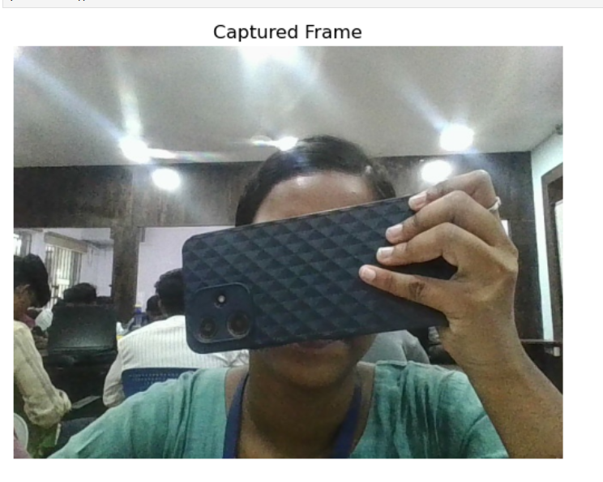
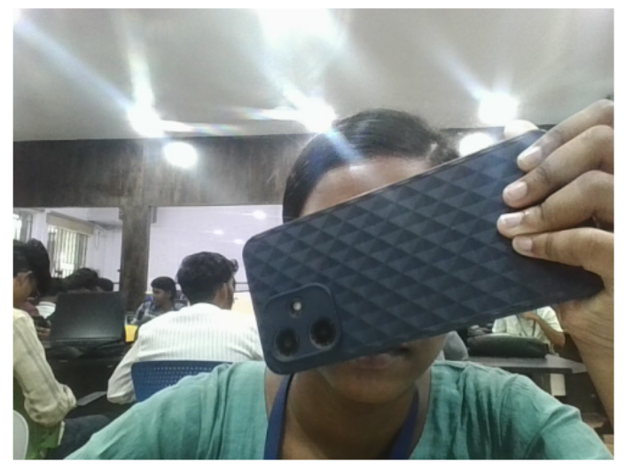
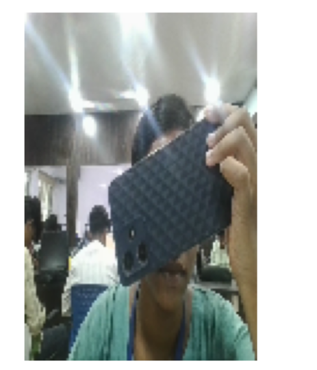
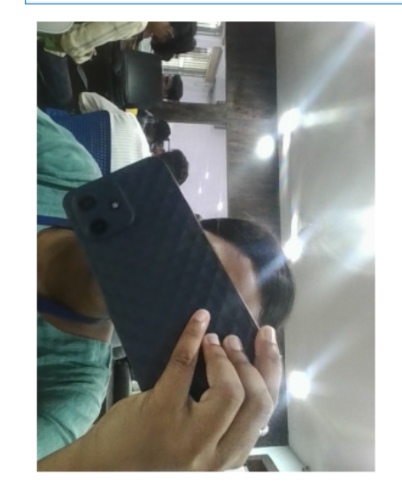

Aim:
 
To write a python program using OpenCV to capture the image from the web camera and do the following image manipulations.
i) Write the frame as JPG 
ii) Display the video 
iii) Display the video by resizing the window
iv) Rotate and display the video

## Software Used
Anaconda - Python 3.7
## Algorithm
### Step 1:
<br>
Initialize webcam using cv2.VideoCapture() and read a frame.

### Step 2:
<br>
Capture and save a single frame as a JPEG and display it.

### Step 3:
<br>
Display live video, optionally resizing frames, by looping, converting BGR→RGB, and updating with matplotlib.

### Step 4:
<br>
Rotate video frames as needed before display and release the webcam.

## Program:
``` Python
### Developed By:
### Register No:

## i) Write the frame as JPG file
import cv2
import matplotlib.pyplot as plt
from IPython.display import clear_output
import time

cap = cv2.VideoCapture(0)
ret, frame = cap.read()
if ret:
    cv2.imwrite("captured_frame.jpg", frame)
cap.release()

captured_image = cv2.imread('captured_frame.jpg')

plt.imshow(captured_image[:,:,::-1])
plt.title('Captured Frame')
plt.axis('off')
plt.show()

## ii) Display the video

cap = cv2.VideoCapture(0)

for i in range(50):
    ret, frame = cap.read()
    if not ret:
        break
    frame_rgb = cv2.cvtColor(frame, cv2.COLOR_BGR2RGB)
    clear_output(wait=True)
    plt.imshow(frame_rgb)
    plt.axis('off')
    plt.show()
    time.sleep(0.05)

cap.release()


## iii) Display the video by resizing the window

cap = cv2.VideoCapture(0)

for i in range(50):
    ret, frame = cap.read()
    if not ret:
        break
    resized_frame = cv2.resize(frame, (100, 150))  # Resize to 320x240
    frame_rgb = cv2.cvtColor(resized_frame, cv2.COLOR_BGR2RGB)
    clear_output(wait=True)
    plt.imshow(frame_rgb)
    plt.axis('off')
    plt.show()
    time.sleep(0.05)

cap.release()


## iv) Rotate and display the video

cap = cv2.VideoCapture(0)

for i in range(50):
    ret, frame = cap.read()
    if not ret:
        break
    rotated_frame = cv2.rotate(frame, cv2.ROTATE_90_CLOCKWISE)
    frame_rgb = cv2.cvtColor(rotated_frame, cv2.COLOR_BGR2RGB)
    clear_output(wait=True)
    plt.imshow(frame_rgb)
    plt.axis('off')
    plt.show()
    time.sleep(0.05)

cap.release()

```
## Output

### i) Write the frame as JPG image
</br>



</br>


### ii) Display the video
</br>



</br>


### iii) Display the video by resizing the window
</br>



</br>

### iv) Rotate and display the video
</br>



</br>

## Result:
Thus the image is accessed from webcamera and displayed using openCV.
